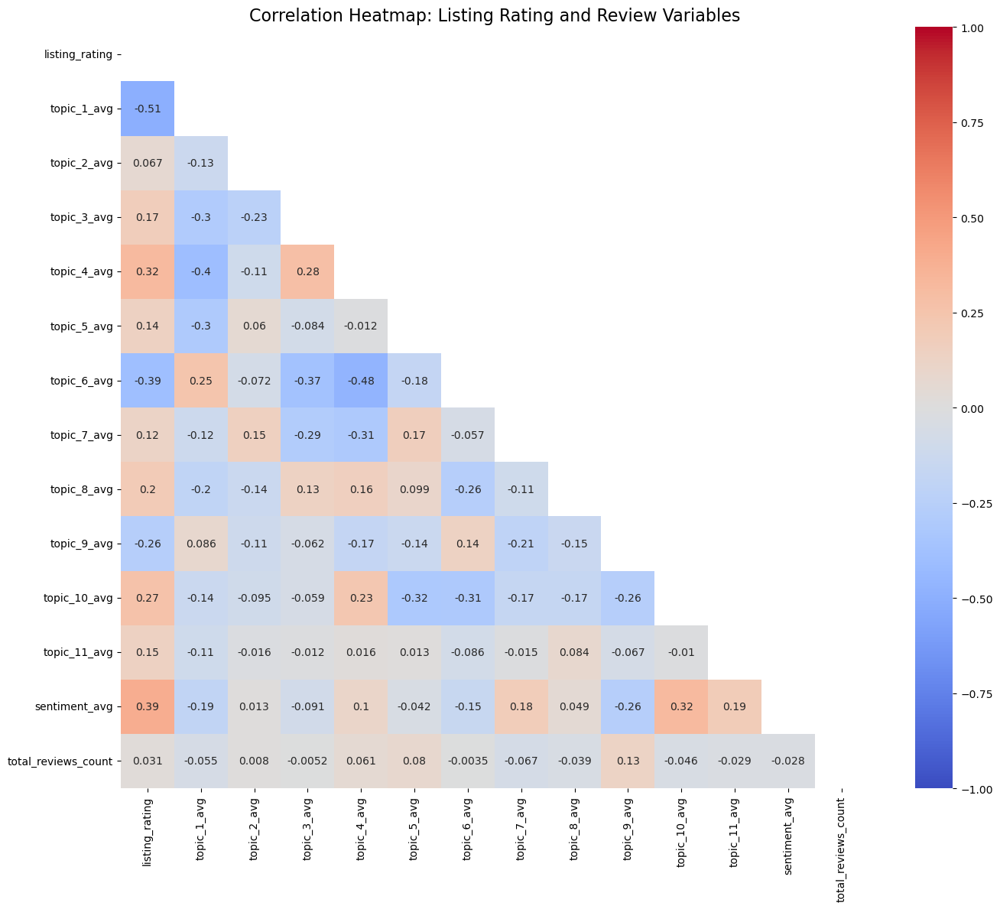
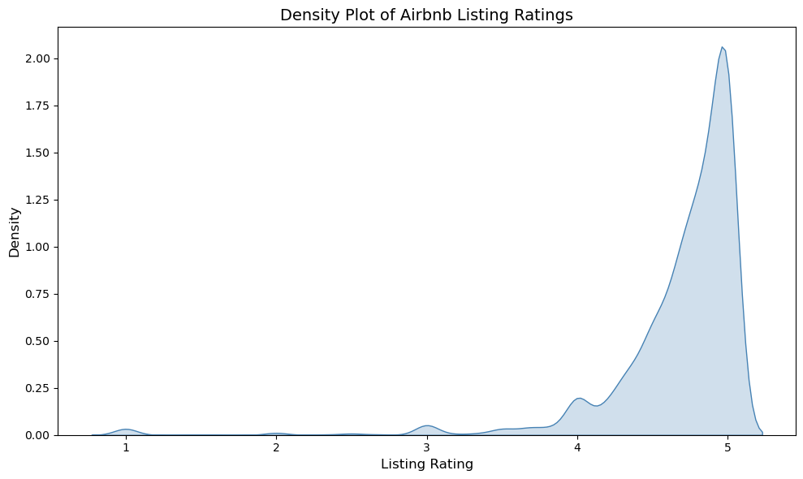
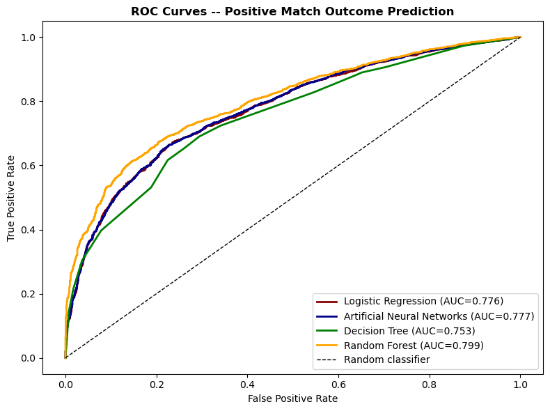
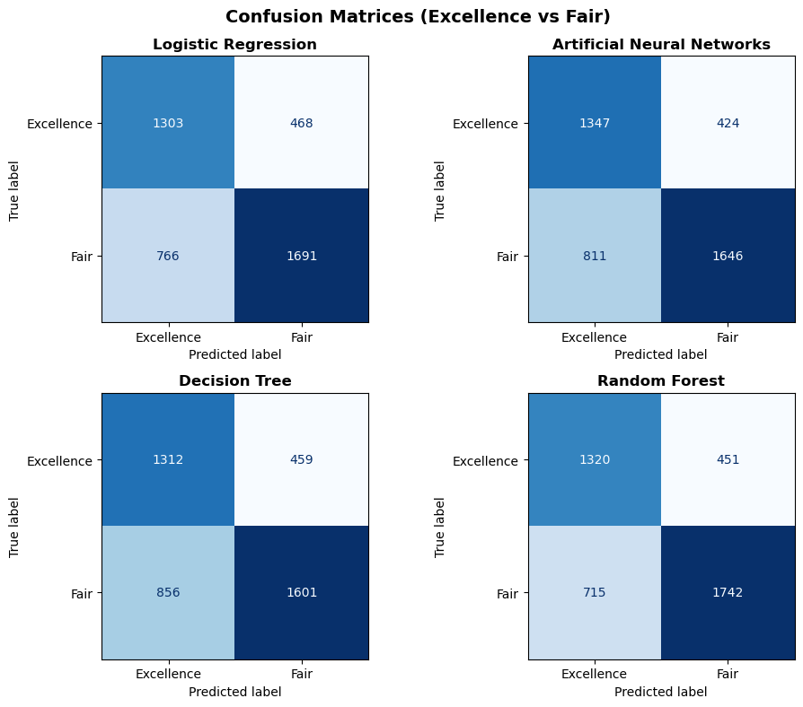

# Predicting Airbnb Guest Satisfaction in London

This project investigates what drives guest satisfaction for Airbnb listings in London, and tests whether signals extracted from guest reviews add predictive power beyond a listing's physical attributes. The dataset is sampled from the intermediate research outputs of Chen, Anker & Liang (2025), *"Business continuity management in the sharing economy: Insights from Airbnb online reviews"* (*Tourism Management*, 107, 105067), and combines two files: **listing-level attributes** (price, room type, host metrics, location) and **review-derived features** (sentiment scores and 11 topic proportions produced by the original study's fine-tuned Structural Topic Model).

The goal was to classify each listing as **Excellence** or **Fair**, based on its review rating, and to test whether physical listing data alone is enough to predict guest satisfaction — or whether what guests actually *say* in reviews matters more.

## Data pre-processing

**Tools:** Python (pandas, NumPy), Jupyter Notebook

**Techniques:** missing-value imputation, string-to-numeric conversion, inner-join merging, categorical encoding, correlation analysis

The two source files were merged on listing ID using an inner join, keeping only listings that have at least one review — a left join would have kept ~2,800 listings with no review data at all, which isn't usable for this analysis.

**Handling missing values**
- Rows missing `host_listings_count` (only 3 rows) were dropped outright — too small a fraction to justify imputation.
- `host_response_time`, a categorical field, had its missing values filled with an explicit `"Unknown"` category rather than dropped, since non-response is itself potentially informative.
- `beds` and `bedrooms` were imputed with the **median**, not the mean, to avoid producing physically meaningless fractional values (e.g. 1.7 beds).
- `host_acceptance_rate` and `host_response_rate` were also imputed with the median after conversion (below), since the data is skewed and a mean would be dragged down by outliers.

**Formatting fixes**
- `host_acceptance_rate` and `host_response_rate` arrived as percentage strings (`'95%'`) and were converted to `float64` in the 0–1 range (`0.95`).

**Exploratory correlation check**

Sentiment and several review topics show moderate-to-strong correlation with listing rating — topics 1, 6, and 9 correlate negatively (likely complaint-driven themes), while sentiment and topics 4, 8, and 10 correlate positively. Review count itself barely correlates with rating at all, suggesting *what* guests say matters far more than *how many* reviews a listing has.

**Target variable**

Ratings are heavily left-skewed, clustered near 5. Rather than using a raw regression target, listings were split into two classes based on the rating distribution: the top 40% as `Excellence`, the bottom 60% as `Fair` — turning this into a binary classification problem.

## Modeling

**Tools:** scikit-learn, imbalanced-learn

**Techniques:** train/test split with stratification, class rebalancing (random oversampling), hyperparameter tuning (grid search + stratified k-fold cross-validation), model comparison

Four classifiers were trained and tuned: **Logistic Regression**, **Artificial Neural Network**, **Decision Tree**, and **Random Forest**. Each was trained twice — once on listing attributes only (**base model**), and once on listing + review-derived features (**full model**) — to isolate the effect of the review data specifically. A fixed random seed was used throughout for reproducibility.

## Results

Adding review-derived features improved every single model, often substantially:

| Model | Base ROC-AUC (listing only) | Full ROC-AUC (listing + review) |
|---|---|---|
| Logistic Regression | 0.652 | 0.776 |
| Artificial Neural Network | 0.652 | 0.777 |
| Decision Tree | 0.648 | 0.753 |
| **Random Forest** | 0.703 | **0.799** |

**Random Forest (full model)** was the best performer, with the highest ROC-AUC and the best balance of precision and recall on the harder-to-predict `Excellence` class.

### Key findings

- **Review sentiment and topics outrank physical attributes.** In the Random Forest's feature importance ranking, `sentiment_avg` and several review-topic variables sit well above price, location, and property size — static listing data can't capture the actual quality of a guest's experience the way review content can.
- **Host professionalism is a meaningful signal.** `host_listings_count` ranks among the top predictors, suggesting hosts who manage multiple properties tend to run more standardized, reliable operations.
- **Review-topic variables are correlated with each other**, which limits how confidently any single topic's importance score can be interpreted in isolation (see the notebook's discussion of Mean Decrease in Impurity and its limitations).

## Data & citation

> Chen, B., Anker, T., & Liang, X. (2025). Business continuity management in the sharing economy: Insights from Airbnb online reviews. *Tourism Management*, 107, 105067. https://doi.org/10.1016/j.tourman.2024.105067

Used here with the original researchers' permission for portfolio/educational purposes. Review-topic variables were generated using the original study's fine-tuned Structural Topic Model (STM); see Table 2 of the source article for topic-label interpretations.

*Originally developed as a graded project for CGMAI3003U — Machine Learning for Predictive Analytics in Business (CBS International Summer University Programme); adapted here for portfolio presentation.*

